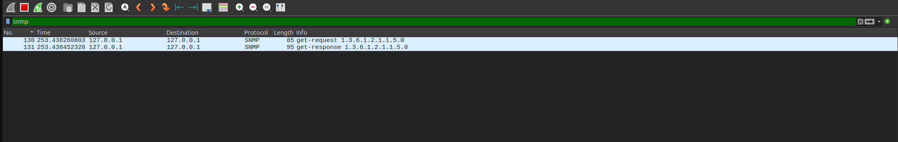
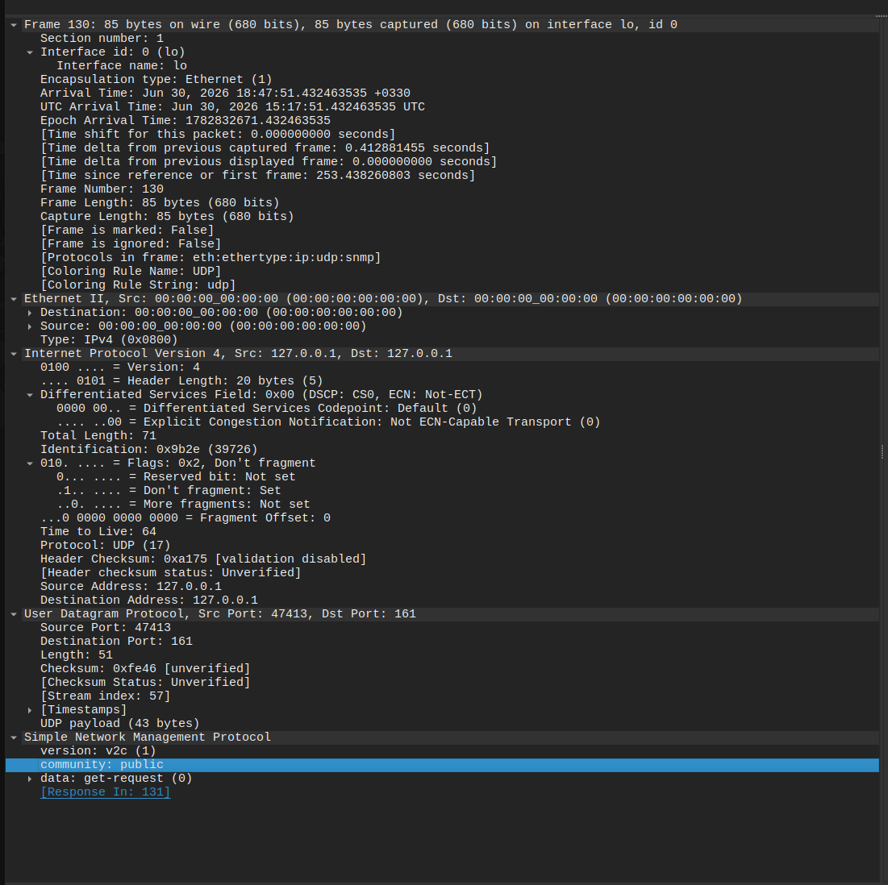
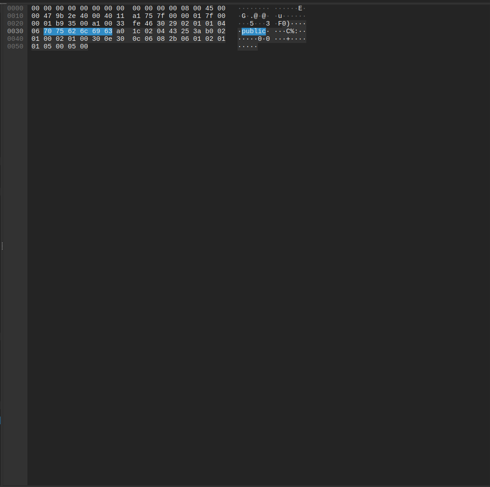

# Inside SNMP: From Packets to Rust

> **Inside Protocols — Part 1**
> Every article in this series follows the same path: **Theory → Packet → Attack → Code → Lab.**

---

## 1. Motivation

How does Zabbix know your CPU usage without ever logging into your Linux server?

How does a monitoring dashboard show the uptime, the interfaces, the running processes of a router you never SSH into?

The answer is a quiet, old, and surprisingly powerful protocol: **SNMP**. In this article we won't just *use* it — we'll watch its packets travel across the wire, look at it through an attacker's eyes, and then build an SNMP packet **byte by byte in Rust**, with no SNMP library at all.

By the end, you'll have sent a hand-crafted packet to a real agent and decoded its reply down to individual bytes.

---

## 2. The Theory

SNMP (Simple Network Management Protocol) is a protocol for monitoring and managing network devices over UDP. Four concepts are enough to get started:

- **SNMP** — a request/response protocol running on **UDP port 161**.
- **Manager / Agent** — the *Manager* asks questions (think Zabbix, or the Rust code below); the *Agent* runs on the target device and answers.
- **MIB** — a hierarchical database describing everything an Agent can expose.
- **OID** — a unique, dotted address pointing to one piece of data inside the MIB.

That's the whole mental model: the Manager sends a question addressed to an OID, and the Agent answers.

---

## 3. The Packet

Here's a real SNMP exchange captured in Wireshark — a `get-request` and its matching `get-response`:



SNMP nests neatly inside the lower network layers:

```
Ethernet → IP → UDP (161) → SNMP
                              ├─ Version
                              ├─ Community
                              └─ PDU
                                  └─ Variable Bindings
```

Expanding the packet in Wireshark shows exactly this structure — version, community string, the PDU type, and the variable binding holding the OID we asked for:



Now let's decode one OID. The classic example is `sysName`, the system's name:

```
1.3.6.1.2.1.1.5.0
 │ │ │ │ │ │ │ │ └─ instance (0)
 │ │ │ │ │ │ │ └─── sysName
 │ │ │ │ │ │ └───── system
 │ │ │ │ │ └─────── mib-2
 │ │ │ │ └───────── mgmt
 │ │ │ └─────────── internet
 │ │ └───────────── dod
 │ └─────────────── org
 └───────────────── iso
```

Every number is one step down the MIB tree. `1.3.6.1.2.1.1.5.0` literally reads: *iso → org → dod → internet → mgmt → mib-2 → system → sysName → instance 0.*

---

## 4. The Attack

Switch hats. You're a pentester, and you've found UDP 161 open on a host. One command:

```bash
snmpwalk -v2c -c public TARGET
```

If the community string is the default `public` — and it astonishingly often is — the agent hands you:

- **Hostname** and system description
- **Kernel** and OS version
- **Network interfaces** and their addresses
- **Routing table**
- **Installed software**
- **Running processes**

Why does an attacker care? This is enumeration gold. The OS version narrows down which exploits to try. The process and software list reveals what's worth attacking. The interface and routing data maps the internal network for lateral movement — all without a single login.

The lesson for defenders is the flip side: default community strings and SNMP exposed to untrusted networks are a free reconnaissance gift to anyone scanning your range.

---

## 5. The Code

Here's what sets this article apart from the hundreds of "just run snmpwalk" posts. Instead of leaning on a library, we'll build an SNMP GET packet **by hand** in Rust and send it over a raw UDP socket.

An SNMP packet is encoded in **ASN.1** using **BER (Basic Encoding Rules)**. Every field is a *type–length–value* triple. Once you see that pattern, the mystery disappears.

```rust
use std::net::UdpSocket;

fn main() -> std::io::Result<()> {
    // SNMP GET for OID 1.3.6.1.2.1.1.5.0 (sysName.0)
    // Hand-encoded as BER / ASN.1, byte by byte.
    let packet: [u8; 43] = [
        0x30, 0x29,                          // SEQUENCE, length 41
            0x02, 0x01, 0x01,                // INTEGER: version = 1 (v2c)
            0x04, 0x06, 0x70,0x75,0x62,0x6c,0x69,0x63, // OCTET STRING: "public"
            0xa0, 0x1c,                      // PDU: GetRequest, length 28
                0x02, 0x04, 0x12,0x34,0x56,0x78, // INTEGER: request-id
                0x02, 0x01, 0x00,            // INTEGER: error-status = 0
                0x02, 0x01, 0x00,            // INTEGER: error-index = 0
                0x30, 0x0e,                  // SEQUENCE OF: variable-bindings
                    0x30, 0x0c,              // SEQUENCE: one varbind
                        // OID: 1.3.6.1.2.1.1.5.0
                        0x06, 0x08, 0x2b,0x06,0x01,0x02,0x01,0x01,0x05,0x00,
                        0x05, 0x00,          // NULL (value slot, empty for a GET)
    ];

    let socket = UdpSocket::bind("0.0.0.0:0")?;
    socket.send_to(&packet, "127.0.0.1:161")?;
    println!("Sent {} bytes", packet.len());

    let mut buf = [0u8; 1500];
    let (n, src) = socket.recv_from(&mut buf)?;
    println!("Received {} bytes from {}", n, src);
    println!("Raw response: {:02x?}", &buf[..n]);

    // Crude extraction of the last OCTET STRING — the sysName value.
    if let Some(last) = buf[..n].iter().rposition(|&b| b == 0x04) {
        let len = buf[last + 1] as usize;
        let val = &buf[last + 2..last + 2 + len];
        println!("sysName = {}", String::from_utf8_lossy(val));
    }

    Ok(())
}
```

The data flows like this:

```
Rust → UDP Socket → ASN.1 → BER Encoding → SNMP Packet → Linux Agent
```

Notice the bytes `0x70 0x75 0x62 0x6c 0x69 0x63` in the array — that's `public` in ASCII. The exact same bytes Wireshark highlights when you click the community field:



Running it against a local agent produces:

```
Sent 43 bytes
Received 53 bytes from 127.0.0.1:161
Raw response: [30, 33, 02, 01, 01, 04, 06, 70, 75, 62, 6c, 69, 63, a2, 26,
02, 04, 12, 34, 56, 78, 02, 01, 00, 02, 01, 00, 30, 18, 30, 16, 06, 08, 2b,
06, 01, 02, 01, 01, 05, 00, 04, 0a, 4d, 79, 4c, 61, 62, 41, 67, 65, 6e, 74]
sysName = MyLabAgent
```

### Reading the reply byte by byte

This is the most rewarding part. Let's decode what the agent sent back:

```
30 33                                SEQUENCE (the whole message)
02 01 01                             version = 1 (v2c)
04 06 70 75 62 6c 69 63              community = "public"
a2 26                                PDU type a2 = GetResponse
02 04 12 34 56 78                    request-id = the exact 0x12345678 we sent
02 01 00                             error-status = 0  (success)
02 01 00                             error-index = 0
30 18 30 16                          variable-bindings
06 08 2b 06 01 02 01 01 05 00        OID = 1.3.6.1.2.1.1.5.0  (sysName.0)
04 0a 4d 79 4c 61 62 41 67 65 6e 74  OCTET STRING, length 10 = "MyLabAgent"
```

Two details are worth pausing on:

First, the PDU type changed from `a0` (GetRequest) in our packet to `a2` (GetResponse) in the reply. Same structure, different tag — that's how the agent signals "this is an answer, not a question."

Second, the `request-id` came back *unchanged* — the same `12 34 56 78` we hard-coded. This is exactly how SNMP matches a response to the request that triggered it, even when many are in flight at once.

And `4d 79 4c 61 62 41 67 65 6e 74` is just `MyLabAgent` in ASCII — the name we configured on the agent. The loop is closed: config → agent → raw packet → hand-parsed in Rust. No magic anywhere, only encoding.

---

## 6. The Lab

Everything above is reproducible in a couple of minutes.

**Tools:** `snmpd`, Wireshark, tcpdump, snmpwalk, and Rust.

The simplest setup runs the agent directly on your machine:

```bash
sudo apt install -y snmpd snmp
echo "rocommunity public  localhost" | sudo tee /etc/snmp/snmpd.conf
echo "sysName MyLabAgent"            | sudo tee -a /etc/snmp/snmpd.conf
sudo systemctl restart snmpd
```

Prefer containers? A minimal `docker-compose.yml`:

```yaml
services:
  snmp-agent:
    image: polinux/snmpd
    container_name: snmp-lab
    ports:
      - "161:161/udp"
```

Confirm the agent answers:

```bash
snmpwalk -v2c -c public localhost
snmpget  -v2c -c public localhost 1.3.6.1.2.1.1.5.0
```

To watch the traffic in Wireshark, capture on the **loopback** interface (`lo`) with the display filter `snmp`, then run the `snmpget` above to generate a clean request/response pair.

**Exercises:**

1. Find the OID for the system's **Load Average**.
2. Change the community string from `public` to `private` and test again.
3. Start a Wireshark capture, run the Rust program, and confirm the packet it sends matches the one `snmpget` produces — byte for byte.

> ⚠️ **Only test systems you own or have explicit permission to test.** Everything here targets a local lab agent.

---

## 7. Conclusion

We started from a vague question — *how does monitoring software see inside a machine it never logs into?* — and worked all the way down to individual bytes on the wire, then back up through Rust.

In the next article, we'll implement a full SNMP GET request from scratch in Rust — **no SNMP library, and no hand-typed byte array either**. We'll build the ASN.1/BER encoder ourselves so it computes the OID and every length field on its own.

---

*All code, lab files, and Wireshark captures for this series live on GitHub:*
👉 [github.com/itsMehrnaz/inside-protocols](https://github.com/itsMehrnaz/inside-protocols)
